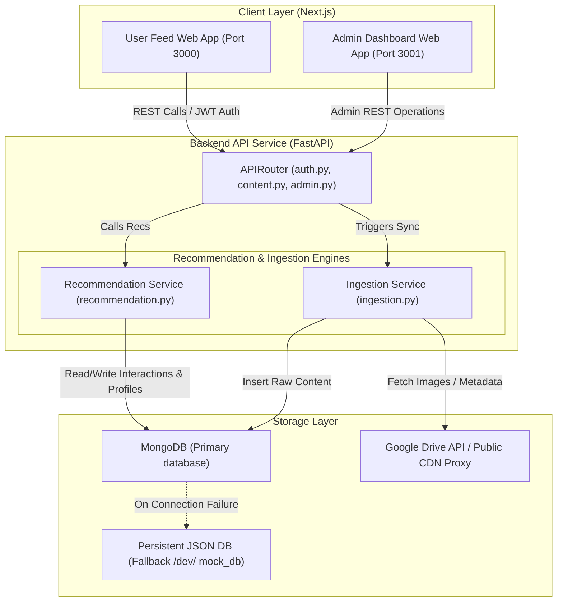

# Case Study Design: FeedSmart Recommendation Feed System

This document provides a comprehensive design report for the **FeedSmart** recommendation feed system, answering all the descriptive questions from the case study, and mapping them directly to the active implementation in the **Pixora** project.

---

## Q1. Requirements Analysis
FeedSmart requires a set of robust functional and non-functional requirements to satisfy real-time personalization, low-latency delivery, and global scalability.

### Functional Requirements
1. **User Onboarding and Interest Profiling**: New users must select categories of interest (e.g., Nature, Technology, Recipes) upon sign-up to bootstrap recommendations and avoid the "cold start" problem.
2. **User Interaction Tracking**: Real-time tracking of explicit and implicit user behaviors, including views (implicit), likes (explicit), saves (explicit), shares (explicit), comments (explicit), and watch/dwell time (implicit).
3. **Personalized Feed Generation**: Generating a custom content feed for each user based on their dynamically updated interest profile, sorted by relevance.
4. **Trending Content Feed**: Generating a high-engagement, randomized feed composed of popular content across different tiers to highlight viral items and preserve variety.
5. **Multi-Source Ingestion Pipeline**: Ingestion of content from various external APIs (e.g., Unsplash, Pexels) and cloud drives (e.g., Google Drive folders/files/catalogs).
6. **Admin Dashboard**: A portal for content curators to trigger data ingestion, monitor system health KPIs, view engagement analytics, and review system logs.

### Non-Functional Requirements
1. **Low Latency (<150ms)**: Feeds must load within milliseconds to prevent user churn, requiring efficient indexing and query structures.
2. **Real-time Recalculation**: Recommendation weights must adjust immediately after an interaction (e.g., liking a post should immediately bias the feed toward that category).
3. **High Availability and Fault Tolerance**: The system must remain available even if backend databases or external ingestion APIs go offline.
4. **Data Diversity and Novelty**: Preventing the feed from becoming a "filter bubble" or monotonous loop by interleaving categories and incorporating exploration noise.
5. **Security and Access Control**: Secure token-based authentication (JWT) for users, rate limiting to prevent scrape/abuse attacks, and strict Content Security Policies (CSP) to block script injections.

---

## Q2. System Architecture Design
The Pixora codebase implements a layered architecture consisting of a client side, an API Gateway layer, services, and databases.

### High-Level Architecture Component Interactions



1. **User Activity Tracker**: Intercepts actions on the Next.js frontend (e.g., a double-tap triggers a like, opening a post triggers a view, scrolling records watch dwell time) and sends them to the `/api/content/{id}/like`, `/api/content/{id}/watch`, etc. endpoints.
2. **Recommendation Engine**: Listens to interaction endpoints, recalculates the user's category-weight interests, and serves personalized recommendations by matching content metadata against user weights.
3. **Ranking Service**: Applies a multi-factor score consisting of category interest, global popularity, recency decay, and stochastic noise.
4. **Cache / Fallback Layer**: Implements a dual DB strategy. When MongoDB is unavailable, the app uses a persistent file-based JSON DB (`.mock_db/`) to ensure service continuity.
5. **Analytics Pipeline**: Collects aggregated views, likes, and saves to calculate growth graphs, category distributions, and overall content engagement for the Admin panel.

---

## Q3. Recommendation Generation and Ranking
The system generates personalized feeds using a **dynamic interest-matching heuristic** reinforced by interaction tracking.

### 1. User Profile Update Heuristic
When a user interacts with content of category $c$, their interest score is recalculated.
Each action type is assigned a weight:
*   **Save**: $+8.0$ (Strongest bookmark signal)
*   **Comment**: $+6.0$ (High explicit engagement)
*   **Like**: $+5.0$ (Explicit endorsement)
*   **Share**: $+3.0$ (Explicit distribution)
*   **Watch**: $+1.5$ (Implicit continuous interest)
*   **View**: $+1.0 \times \ln(1 + \text{dwell\_time})$ (Implicit browse interest, scaled by duration)
*   **Unlike / Unsave**: $-5.0$ and $-8.0$ respectively (Strong negative signal)

#### Recency Decay
To ensure the system adapts to changing user tastes, interaction weights decay over time using a logarithmic decay function:
$$W_{\text{decayed}} = W \times \frac{1}{1 + \ln(1 + \frac{\text{age\_hours}}{24})}$$
Recent interactions (within 24 hours) retain maximum weight, while older interactions fade gradually. The normalized weights across categories sum to $1.0$, creating the user's `interests` map.

### 2. Scoring Formula
Every candidate content item $i$ is scored using a linear combination of signals:
$$\text{Score}(i) = 0.60 \times \text{Interest}(c_i) + 0.25 \times \text{Popularity}(i) + 0.12 \times \text{Recency}(i) + 0.03 \times \text{Noise}$$
Where:
*   $\text{Interest}(c_i)$: The user's weight for category $c_i$ (e.g., $0.6$ for Nature).
*   $\text{Popularity}(i)$: Normalized engagement score based on views, likes, saves, and shares:
    $$\text{Engagement}(i) = \text{Views} + 3 \times \text{Likes} + 5 \times \text{Saves} + 2 \times \text{Shares}$$
*   $\text{Recency}(i)$: Time decay based on upload age: $\frac{1}{1 + \text{age\_days}}$.
*   $\text{Noise}$: A uniform random value $\sim U(0.0, 1.0)$ to encourage exploration and serendipity.

### 3. Real-Time Slot Allocation
To avoid showing only one category (filter bubble), the system guarantees category diversity:
1.  **Proportional Slots**: If a user is 60% interested in Technology, the system attempts to allocate 60% of the feed page (up to a capped limit of 70%) to Technology content.
2.  **Diversity Guarantee**: At least 1 slot is allocated to every category represented in the database.
3.  **Interleaving**: Items selected from each category pool are merged and sorted by their final score to build a unified feed.

---

## Q4. Database Design
Pixora utilizes a Document-oriented NoSQL model (MongoDB / JSON) which is ideal for the flexible schemas, deep object nesting, and high-frequency writes typical of feed systems.

### Collections

#### 1. Users Collection (`users`)
Stores profile info, onboarding selections, and the dynamically updated interest weights.
```json
{
  "_id": "usr_772c918b",
  "name": "Alex Jenkins",
  "email": "alex@example.com",
  "password_hash": "$2b$12$Kj6...",
  "followed_categories": ["Nature", "Technology"],
  "interests": {
    "Nature": 0.625,
    "Technology": 0.375
  },
  "created_at": "2026-06-15T08:00:00Z"
}
```

#### 2. Content Collection (`content`)
Stores image references, categories, tags, and aggregated interaction counters.
```json
{
  "_id": "cnt_9a12c83b",
  "title": "Minimalist Desktop Setup",
  "description": "Clean white desk with an ultrawide monitor and keyboard.",
  "image_url": "https://images.unsplash.com/photo-1555066931-4365d14bab8c",
  "thumbnail_url": "https://images.unsplash.com/photo-1555066931-4365d14bab8c?w=400",
  "category": "Technology",
  "source": "Unsplash",
  "tags": ["desk", "setup", "minimalist", "monitor"],
  "likes": 1420,
  "saves": 382,
  "views": 18200,
  "shares": 92,
  "comments": 14,
  "created_at": "2026-06-14T10:12:00Z"
}
```

#### 3. Interactions Collection (`interactions`)
An append-only log of every user action. Supports fast indexing and timeline tracking.
```json
{
  "_id": "int_32c91e84",
  "userId": "usr_772c918b",
  "contentId": "cnt_9a12c83b",
  "actionType": "view",
  "dwellTime": 14.5,
  "comment_text": null,
  "timestamp": "2026-06-15T12:04:12Z"
}
```

#### 4. Settings/Sync Collection (`settings`)
Stores backend parameters, such as the Google Drive sync target.
```json
{
  "_id": "set_drive_sync",
  "key": "google_drive_sync_folder_id",
  "value": "1A_8-8x7...",
  "is_parent": true,
  "category": "Nature"
}
```

---

## Q5. Algorithm and Implementation
A Python-based implementation of the recommendation score calculation and user interest shifting is located in `backend/app/services/recommendation.py`.

### How it Works (Code Walkthrough)

1.  **`update_user_interest_profile(user_id)`**:
    *   Loads the user's followed categories as a baseline score of $15.0$ each.
    *   Retrieves the last 200 interaction logs for the user from MongoDB.
    *   Iterates through interactions: computes time age, applies recency decay multiplier `recency_multiplier = 1.0 / (1.0 + math.log1p(age_hours / 24.0))`, and scales views based on dwell time: `weight * (1.0 + math.log1p(dwell_time))`.
    *   Aggregates the decayed weights per category.
    *   Normalizes the scores to sum to $1.0$ and updates the user document.

2.  **`get_personalized_recommendations(user_id, limit, skip)`**:
    *   Fetches content candidates from the database.
    *   Computes popularity and recency scores for each item.
    *   Applies the linear scoring formula: $0.60 \times \text{Interest} + 0.25 \times \text{Popularity} + 0.12 \times \text{Recency} + 0.03 \times \text{Noise}$.
    *   Divides items into pools by category, allocating slots proportionally (e.g. `slots = interest_ratio * pool_size`).
    *   Applies category caps (max 70% slots for a single category) and guarantees (min 1 slot per category) to ensure variety.
    *   Combines the selected items and sorts by the final recommendation score, returning the requested slice for pagination.

---

## Q6. Scalability and Fault Tolerance
To transition this local architecture to support **millions of active users** and **billions of transactions**, we employ the following distributed processing and fault tolerance paradigms:

### 1. Scaling the Interaction Ingestion Pipeline
*   **Problem**: Real-time synchronous writes to MongoDB for every click, view, scroll, and like will exhaust database connections and cause request timeout bottlenecks.
*   **Solution**: Decouple the write path using **Apache Kafka** or Google Cloud Pub/Sub. Interactions are published to a high-throughput queue instantly. Fast stream-processors (e.g. **Apache Flink** or Spark Streaming) consume the events in batches, update user interest profiles asynchronously, and write aggregated counters back to the main database, keeping API response times under 10ms.

### 2. High-Read Feed Performance
*   **Problem**: Sorting and scoring 2,000+ items on-the-fly for millions of users on every request is CPU-intensive.
*   **Solution**: Introduce **Redis** as a distributed caching layer.
    *   **Pre-computed Feeds**: Run offline batch jobs (e.g., using collaborative filtering or deep learning Two-Tower models) to pre-compute the top 200 recommendations for each user, saving them as serialized Redis lists.
    *   **Fallback Feed Caching**: If a pre-computed list is exhausted or not found, fall back to the dynamic ranking algorithm, store the result in Redis for 5 minutes, and serve subsequent requests from cache.

### 3. Fault Tolerance and Resilience
*   **Fallback DB System**: Pixora implements a local SQLite or file-based fallback database. If MongoDB clusters fail, the application switches to the local storage engine seamlessly.
*   **Fallback Recommendations**: If the personalization database is unreachable or slow, the API instantly degrades gracefully to serve the **diversified global trending feed**, ensuring the user always sees a beautiful, loaded page rather than an error screen.
*   **Rate Limiting and Circuit Breakers**: API endpoints are protected by token rate-limiting to prevent DDoS attempts. Outbound requests to external media APIs (Google Drive, Pexels) are protected by circuit breakers; if the external API slows down, the proxy serves cached placeholders.
